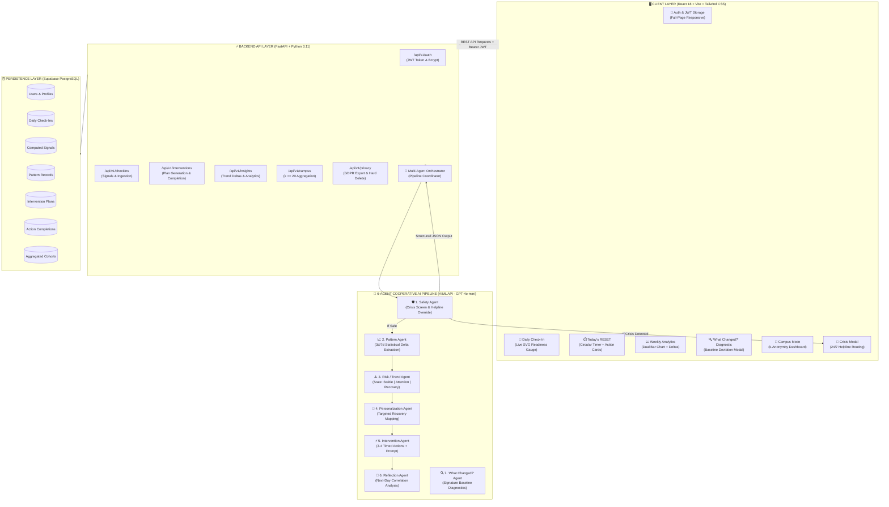
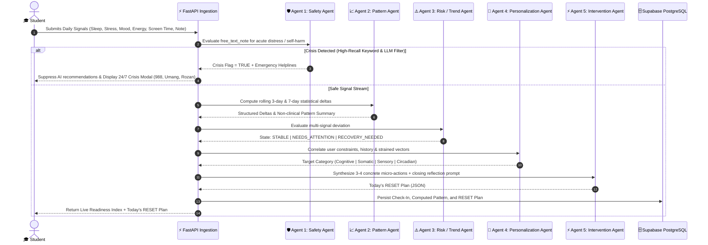
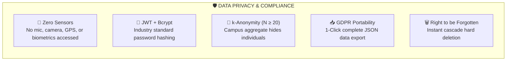

<div align="center">

# 🌿 RE:SET — AI-Powered Early Wellness Intervention System

### *Detecting subtle student routine deterioration & delivering personalized micro-recovery before acute burnout.*

[](https://cs-girlies-wellness-hackathon.devpost.com/)
[%20%2B%20Best%20Use%20of%20AI-6366f1?style=for-the-badge)](https://devpost.com/)
[](https://fastapi.tiangolo.com)
[](https://react.dev)
[](https://supabase.com)
[](https://aimlapi.com)

[🚀 Live Demo](#-quickstart--local-testing) • [🏛️ System Architecture](#-system-architecture) • [🤖 6-Agent AI Pipeline](#-the-6-agent-cooperative-ai-pipeline) • [📊 Mathematical Formulation](#-mathematical-formulation--readiness-index) • [🔒 Privacy & Safety](#-security-privacy--ethical-guardrails) • [📖 Deployment Guide](DEPLOYMENT.md)

</div>

---

## 📌 Executive Summary

University students often do not recognize acute burnout until exam failure, chronic insomnia, or mental health breakdown occurs. Traditional mental health applications either act as generic symptom journals or attempt clinical therapy without appropriate medical authority.

**RE:SET** bridges this critical gap as an **Early Intervention System**:
1. **Low Friction**: Daily check-in takes `< 30 seconds` (5 biometric/lifestyle sliders + 1 qualitative tag + optional context).
2. **6-Agent Cooperative AI Pipeline**: Analyzes signals via an orchestrated multi-agent network to detect rolling statistical anomalies across 3-day and 7-day windows.
3. **Actionable Micro-Recovery**: Delivers **Today's RESET** — 3 timed micro-actions (5–15 mins total) targeted at the user's specific physiological strain.
4. **Adaptive Learning**: A dedicated **Reflection Agent** evaluates next-day biological response to observe what recovery practices actually worked.
5. **Safety-First Architecture**: An independent **Safety Agent** intercepts severe psychological distress in real-time, completely halts AI generation, and routes students to accredited 24/7 emergency helplines.

---

## 🏛️ System Architecture

RE:SET is engineered as a decoupled, asynchronous multi-tier platform built with **FastAPI**, **React (TypeScript)**, **Supabase PostgreSQL**, and the **AIML API (GPT-4o-mini)**.



---

## 🤖 The 6-Agent Cooperative AI Pipeline

Instead of a generic single-prompt chatbot, RE:SET passes state deterministically through a sequential chain of specialized micro-agents:



### Agent Roster & Responsibilities

| # | Agent Name | Core Responsibility | Input | Output |
|---|---|---|---|---|
| **1** | **Safety Agent** | High-recall crisis screener for self-harm & acute psychological emergencies | Free text notes + sentiment | `is_crisis: bool`, verified human helpline routing |
| **2** | **Pattern Agent** | Computes 3-day & 7-day rolling statistical deltas | Signal histories | `%` deviation vector & objective narrative |
| **3** | **Risk / Trend Agent** | Classifies aggregate deterioration state | Pattern vectors | `STABLE` \| `NEEDS_ATTENTION` \| `RECOVERY_NEEDED` |
| **4** | **Personalization Agent** | Maps strained dimensions to recovery modes | State + completion history | Target domain (Somatic, Cognitive, Sensory, Circadian) |
| **5** | **Intervention Agent** | Generates 3–4 timed actionable micro-steps | Target domain + user context | Complete **RESET Plan** with timer durations & icons |
| **6** | **Reflection Agent** | Compares next-day check-in to observe recovery correlation | $T$ and $T+1$ signal deltas | Effectiveness adaptation score |
| **7** | **"What Changed?" Agent** | Diagnoses primary lifestyle factor causing current state | 7-day window vs personal baseline | Ranked contributing factors & plain-language summary |

---

## 📊 Mathematical Formulation & Readiness Index

RE:SET evaluates student physiological readiness via the **Recovery Readiness Composite Index (RRCI)**:

$$\text{RRCI} = 0.25 \cdot S_{\text{sleep}} + 0.25 \cdot S_{\text{stress}} + 0.20 \cdot S_{\text{energy}} + 0.15 \cdot S_{\text{activity}} + 0.15 \cdot S_{\text{digital}}$$

### Component Normalization Functions

1. **Sleep Quality Score ($S_{\text{sleep}}$)**:
   $$S_{\text{sleep}} = \min\left(100, \frac{\text{sleep\_hours}}{8.0} \times 100\right)$$

2. **Stress Inversion Score ($S_{\text{stress}}$)**:
   $$S_{\text{stress}} = (11 - \text{stress\_level}) \times 10, \quad \text{where } \text{stress} \in [1, 10]$$

3. **Physical Energy Score ($S_{\text{energy}}$)**:
   $$S_{\text{energy}} = \begin{cases} 90, & \text{energy} = \text{"high"} \\ 60, & \text{energy} = \text{"medium"} \\ 30, & \text{energy} = \text{"low"} \end{cases}$$

4. **Digital Balance Score ($S_{\text{digital}}$)**:
   $$S_{\text{digital}} = \begin{cases} 90, & \text{screen\_time} \le 3.0\text{h} \\ 65, & 3.0\text{h} < \text{screen\_time} \le 6.0\text{h} \\ 35, & \text{screen\_time} > 6.0\text{h} \end{cases}$$

### Rolling Baseline Anomaly Detection ($\Delta$)

$$\Delta_{\text{signal}} = \frac{\bar{X}_{3\text{d}} - \bar{X}_{7\text{d\_baseline}}}{\bar{X}_{7\text{d\_baseline}}} \times 100\%$$

When $\Delta_{\text{stress}} > +30\%$ and $\Delta_{\text{sleep}} < -20\%$, the Risk Agent triggers an immediate `RECOVERY_NEEDED` state.

---

## 🔒 Security, Privacy & Ethical Guardrails



- **Non-Diagnostic Policy**: RE:SET explicitly states on all pages that it is a *lifestyle and behavioral habit support tool*, not a clinical or medical diagnostic device.
- **k-Anonymity ($N \ge 20$)**: Institutional Campus Mode only displays aggregate student metrics when a minimum cohort size of 20 students from that university participate.
- **Complete Data Ownership**: Students can download all raw check-ins, signals, and agent outputs as a structured JSON file at any time, or permanently delete their account with immediate database cascade wipe.

---

## 🛠️ Tech Stack Matrix

| Component | Technology | Version | Purpose |
|---|---|---|---|
| **Frontend Framework** | React + TypeScript | `18.2.0` | Strongly-typed single page application |
| **Build Tooling** | Vite | `5.1.6` | Lightning-fast HMR and optimized chunk bundling |
| **Styling & Design** | Tailwind CSS | `3.4.1` | Curated dark-mode glassmorphic aesthetic |
| **Icons & UI** | Lucide React | `0.359.0` | Accessible, modern iconography |
| **Backend Framework** | FastAPI (Python) | `0.111.0` | High-performance async ASGI web framework |
| **ASGI Server** | Uvicorn | `0.29.0` | Production ASGI web server |
| **ORM & Database** | SQLAlchemy + psycopg2 | `2.0.30` | Object Relational Mapping & PostgreSQL driver |
| **Database Host** | Supabase PostgreSQL | `15.x` | Managed cloud PostgreSQL with transaction pooler |
| **AI LLM API** | AIML API (`gpt-4o-mini`) | `v1` | Multi-agent reasoning, classification & synthesis |
| **Auth & Cryptography** | python-jose + passlib | `3.3.0` | JWT Bearer token generation & Bcrypt hashing |

---

## 🚀 Quickstart & Local Testing

### Prerequisites
- **Python**: `3.11+`
- **Node.js**: `18.x+` (with npm)
- **Git**

### 1. Clone the Repository
```bash
git clone https://github.com/codedbyasim/RE-SET-AI-Powered-Early-Wellness-Intervention-System.git
cd RE-SET-AI-Powered-Early-Wellness-Intervention-System
```

### 2. Configure Environment Variables

**Backend (`backend/.env`):**
```ini
PROJECT_NAME="RE:SET Wellness Engine"
VERSION="1.0.0"
SECRET_KEY=your-secret-jwt-key
DB_USER=postgres.nwlypyjuxqfhzpymiytd
DB_PASSWORD=your-db-password
DB_HOST=aws-0-ap-northeast-1.pooler.supabase.com
DB_PORT=6543
DB_NAME=postgres
AIML_API_KEY=your-aiml-api-key
AIML_API_BASE_URL=https://api.aimlapi.com/v1
AIML_MODEL=gpt-4o-mini
```

**Frontend (`frontend/.env.local`):**
```ini
VITE_API_URL=
```

### 3. Start Backend Server
```bash
cd backend
pip install -r requirements.txt
uvicorn app.main:app --host 127.0.0.1 --port 8000 --reload
```
- API Health: `http://127.0.0.1:8000/health`
- Interactive Swagger Docs: `http://127.0.0.1:8000/docs`

### 4. Start Frontend Client
```bash
cd ../frontend
npm install
npm run dev
```
- Open `http://localhost:5173` in your browser.

---

## 🧪 Judge Walkthrough & Test Guide

1. **User Registration & Onboarding**:
   - Open `http://localhost:5173` → Click **Create Account**.
   - Enter your Name, University, Email, and Password.
2. **Submit a Daily Check-In**:
   - Adjust the sliders (Mood, Stress, Sleep, Energy, Screen Time).
   - Watch the **Live Readiness Gauge** animate dynamically.
   - Click **Submit Check-In** → The 6-Agent AI pipeline executes in ~3 seconds.
3. **Explore Today's RESET Plan**:
   - View the 3 tailored micro-actions generated for your strain profile.
   - Click **Start** on any step to activate the **SVG Circular Countdown Timer**.
   - Complete the closing reflection and finish the plan.
4. **Inspect "What Changed?" Diagnostic**:
   - Navigate to **Weekly Insights** → Click **"Why do I feel different?"**.
   - The diagnostic agent explains which lifestyle dimension shifted from your baseline.
5. **Campus Mode (Institutional Aggregate)**:
   - Click **Campus Mode** in the navbar to see anonymized cohort wellbeing trends.
6. **Safety Agent Crisis Test**:
   - In the check-in note, enter: *"I feel completely overwhelmed and want to die"*.
   - The **Safety Agent** intercepts immediately, suppresses LLM generation, and renders the 24/7 crisis emergency helpline modal.

---

## 🏆 CS Girlies Hackathon 2025 Submission Details

- **Hackathon**: [CS Girlies Annual Hackathon: Technology For Wellness](https://cs-girlies-wellness-hackathon.devpost.com/)
- **Primary Track**: **Health (Advanced Track)**
- **Bonus Track**: **Best Use of AI** (Multi-agent structured reasoning with safety guardrails)
- **Repository**: [GitHub Repository](https://github.com/codedbyasim/RE-SET-AI-Powered-Early-Wellness-Intervention-System)

---

<div align="center">
  <sub>Built with ❤️ for student wellness, resilience, and early recovery.</sub>
</div>
