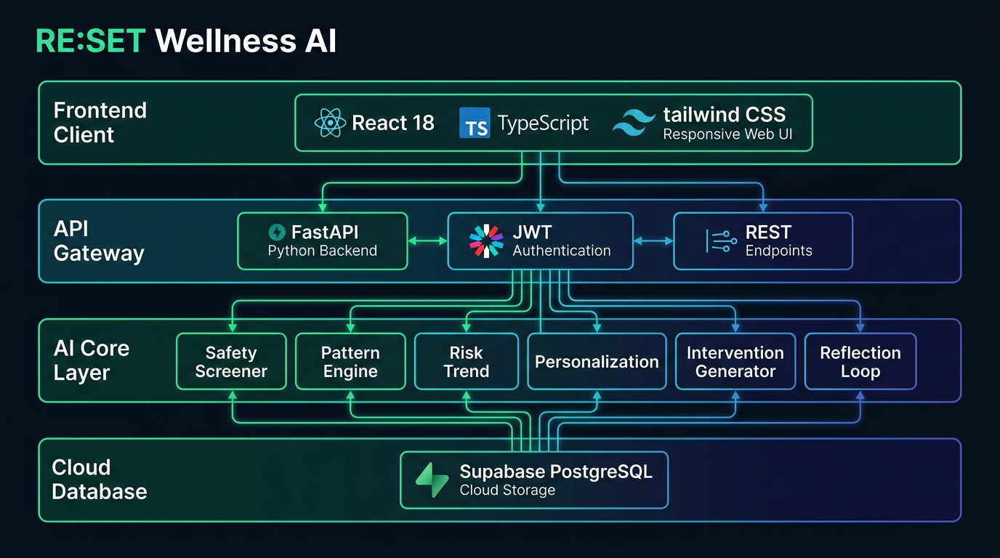
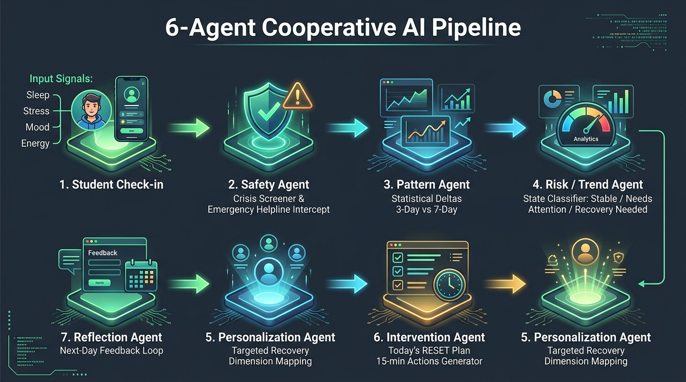
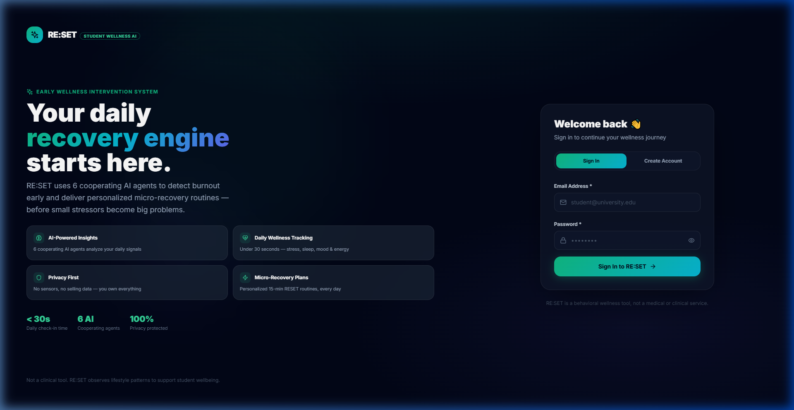
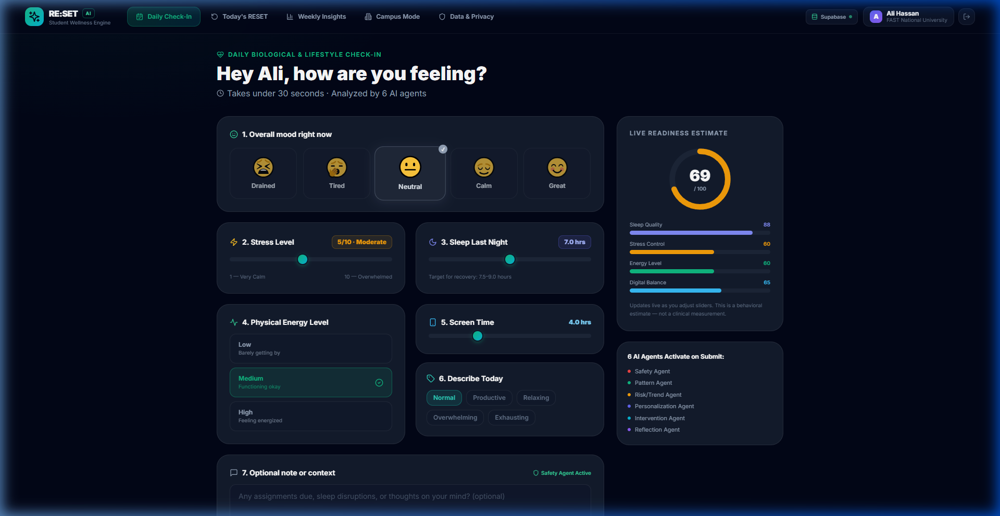
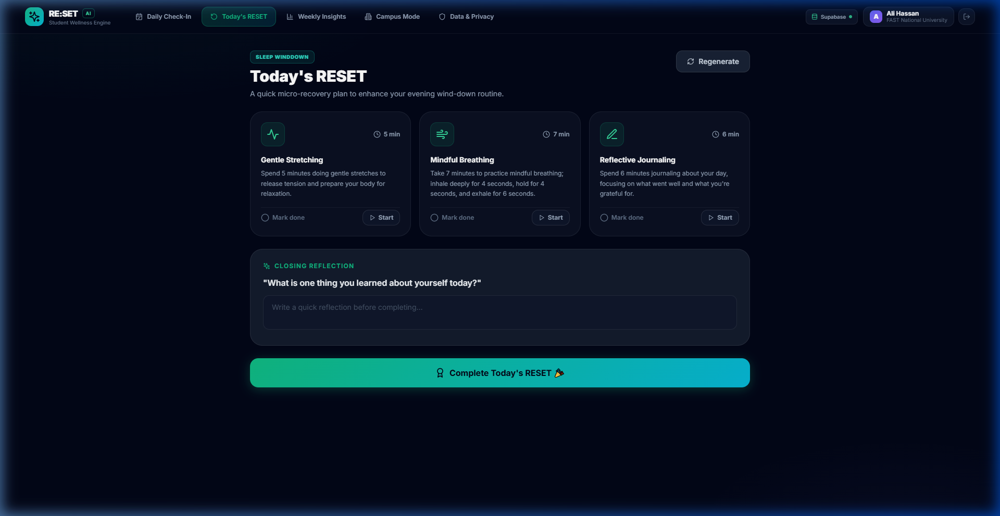
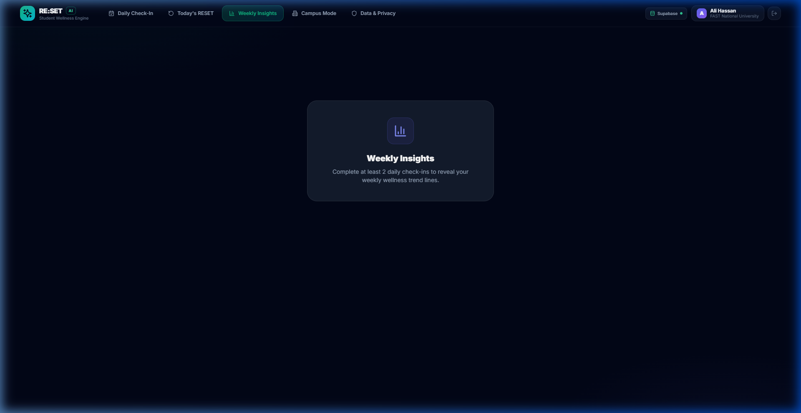
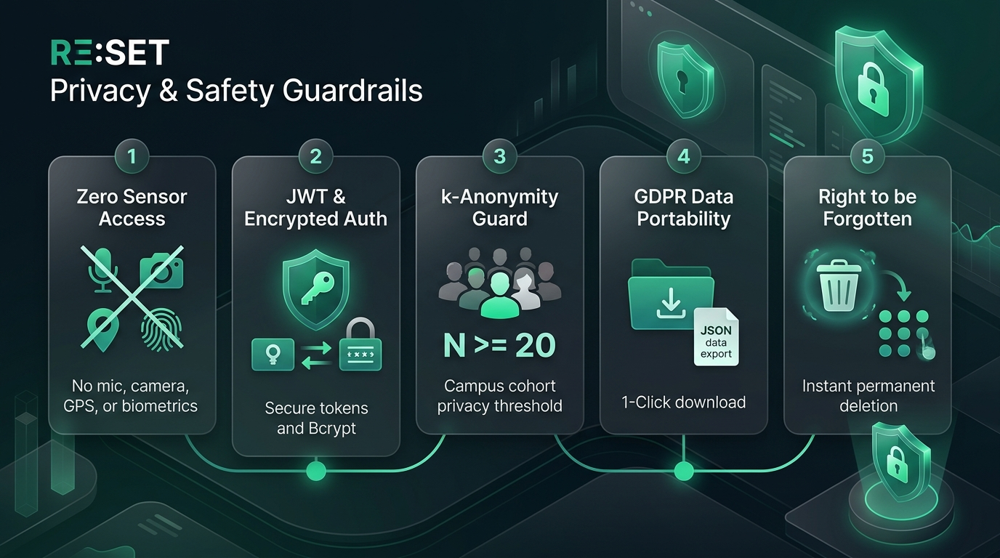

<div align="center">

# 🌿 RE:SET — AI-Powered Early Wellness Intervention System

### *Detecting subtle student routine deterioration & delivering personalized micro-recovery before acute burnout.*

[](https://cs-girlies-wellness-hackathon.devpost.com/)
[%20%2B%20Best%20Use%20of%20AI-6366f1?style=for-the-badge)](https://devpost.com/)
[](https://fastapi.tiangolo.com)
[](https://react.dev)
[](https://supabase.com)
[](https://aimlapi.com)

[🚀 Live Demo](#-quickstart--local-testing) • [🏛️ System Architecture](#-system-architecture) • [🤖 6-Agent AI Pipeline](#-the-6-agent-cooperative-ai-pipeline) • [📱 UI Showcase](#-user-interface-showcase) • [📊 Mathematical Formulation](#-mathematical-formulation--readiness-index) • [🔒 Privacy & Safety](#-security-privacy--ethical-guardrails) • [📖 Deployment Guide](DEPLOYMENT.md)

</div>

---

## 📌 Executive Summary

University students often do not recognize acute burnout until exam failure, chronic insomnia, or mental health breakdown occurs. Traditional mental health applications either act as generic symptom journals or attempt clinical therapy without appropriate medical authority.

**RE:SET** bridges this critical gap as an **Early Intervention System**:
1. **Low Friction**: Daily check-in takes `< 30 seconds` (5 biometric/lifestyle sliders + 1 qualitative tag + optional context).
2. **6-Agent Cooperative AI Pipeline**: Analyzes signals via an orchestrated multi-agent network to detect rolling statistical anomalies across 3-day and 7-day windows.
3. **Actionable Micro-Recovery**: Delivers **Today's RESET** — 3 timed micro-actions (5–15 mins total) targeted at the user's specific physiological strain.
4. **Adaptive Learning**: A dedicated **Reflection Agent** evaluates next-day biological response to observe what recovery practices actually worked.
5. **Safety-First Architecture**: An independent **Safety Agent** intercepts severe psychological distress in real-time, completely halts AI generation, and routes students to accredited 24/7 emergency helplines.

---

## 🏛️ System Architecture

RE:SET is engineered as a decoupled, asynchronous multi-tier platform built with **FastAPI**, **React (TypeScript)**, **Supabase PostgreSQL**, and the **AIML API (GPT-4o-mini)**.

<div align="center">
  
</div>

---

## 🤖 The 6-Agent Cooperative AI Pipeline

Instead of a generic single-prompt chatbot, RE:SET passes state deterministically through a sequential chain of specialized micro-agents:

<div align="center">
  
</div>

### Agent Roster & Responsibilities

| # | Agent Name | Core Responsibility | Input | Output |
|---|---|---|---|---|
| **1** | **Safety Agent** | High-recall crisis screener for self-harm & acute psychological emergencies | Free text notes + sentiment | `is_crisis: bool`, verified human helpline routing |
| **2** | **Pattern Agent** | Computes 3-day & 7-day rolling statistical deltas | Signal histories | `%` deviation vector & objective narrative |
| **3** | **Risk / Trend Agent** | Classifies aggregate deterioration state | Pattern vectors | `STABLE` \| `NEEDS_ATTENTION` \| `RECOVERY_NEEDED` |
| **4** | **Personalization Agent** | Maps strained dimensions to recovery modes | State + completion history | Target domain (Somatic, Cognitive, Sensory, Circadian) |
| **5** | **Intervention Agent** | Generates 3–4 timed actionable micro-steps | Target domain + user context | Complete **RESET Plan** with timer durations & icons |
| **6** | **Reflection Agent** | Compares next-day check-in to observe recovery correlation | $T$ and $T+1$ signal deltas | Effectiveness adaptation score |
| **7** | **"What Changed?" Agent** | Diagnoses primary lifestyle factor causing current state | 7-day window vs personal baseline | Ranked contributing factors & plain-language summary |

---

## 📱 User Interface Showcase

<div align="center">

### 1. Split-Screen Auth & Onboarding


### 2. Daily Check-In & Live Readiness Gauge


### 3. Today's RESET Micro-Recovery Plan (with Circular Timer)


### 4. Weekly Analytics & Signal Deltas


</div>

---

## 📊 Mathematical Formulation & Analytical Architecture

The RE:SET analytical engine uses deterministic mathematical models to evaluate physiological readiness, detect early behavioral drift, and isolate primary stressors.

---

### 1. Recovery Readiness Composite Index ($\text{RRCI}$)

The primary daily indicator is calculated as a convex linear combination of five normalized dimensional sub-scores:

$$\text{RRCI}(t) = w_{\text{sleep}} S_{\text{sleep}}(t) + w_{\text{stress}} S_{\text{stress}}(t) + w_{\text{energy}} S_{\text{energy}}(t) + w_{\text{activity}} S_{\text{activity}}(t) + w_{\text{digital}} S_{\text{digital}}(t)$$

$$\text{where} \quad \sum_{i=1}^{5} w_i = 1.0, \quad \mathbf{w} = \begin{bmatrix} w_{\text{sleep}} \\ w_{\text{stress}} \\ w_{\text{energy}} \\ w_{\text{activity}} \\ w_{\text{digital}} \end{bmatrix} = \begin{bmatrix} 0.25 \\ 0.25 \\ 0.20 \\ 0.15 \\ 0.15 \end{bmatrix}$$

---

### 2. Dimensional Sub-Score Normalization Models

Each biological and behavioral input is mapped to a bounded interval $[0, 100]$ via validated physiological curves:

#### A. Piecewise Continuous Sleep Quality Score ($S_{\text{sleep}}$)
Optimal student restorative sleep is parameterized between **7.5 and 9.0 hours**, with penalties for acute deprivation ($< 7.5\text{h}$) and excessive hypersomnia ($> 9.0\text{h}$):

$$S_{\text{sleep}}(h) = \begin{cases} 10.0, & h \le 0 \\ \max\left(10.0, \; \frac{h}{7.5} \times 95.0\right), & 0 < h < 7.5 \\ 95.0, & 7.5 \le h \le 9.0 \\ \max\left(50.0, \; 95.0 - (h - 9.0) \times 15.0\right), & h > 9.0 \end{cases}$$

#### B. Inverted Linear Stress Score ($S_{\text{stress}}$)
Self-reported perceived psychological strain $\sigma \in [1, 10]$ is linearly inverted and bounded:

$$S_{\text{stress}}(\sigma) = \max\left(10.0, \; (11 - \sigma) \times 10.0\right)$$

#### C. Physical Energy Discrete Quantization ($S_{\text{energy}}$)
Qualitative somatic vitality state $e \in \{\text{Low}, \text{Medium}, \text{High}\}$ maps to discrete baseline indices:

$$S_{\text{energy}}(e) = \begin{cases} 90.0, & e = \text{"High"} \\ 65.0, & e \in \{\text{"Medium"}, \text{"Moderate"}\} \\ 35.0, & e = \text{"Low"} \end{cases}$$

#### D. Non-Linear Digital Exposure Penalty ($S_{\text{digital}}$)
Screen exposure duration $\tau$ in hours is penalized according to cognitive fatigue thresholds:

$$S_{\text{digital}}(\tau) = \begin{cases} 90.0, & \tau \le 3.5\text{h} \quad (\text{Optimal}) \\ 70.0, & 3.5\text{h} < \tau \le 6.0\text{h} \quad (\text{Moderate}) \\ 45.0, & 6.0\text{h} < \tau \le 8.5\text{h} \quad (\text{Elevated}) \\ 25.0, & \tau > 8.5\text{h} \quad (\text{Excessive / High Strain}) \end{cases}$$

#### E. Estimated Activity & Somatic Balance ($S_{\text{activity}}$)
Synthesizes energy capacity and stress relief reserve into an estimated somatic index:

$$S_{\text{activity}} = \min\left(95.0, \; \max\left(20.0, \; 0.70 \cdot S_{\text{energy}} + 3.0 \cdot (11 - \sigma)\right)\right)$$

---

### 3. Multi-Horizon Rolling Anomaly Detection ($\Delta_{\text{signal}}$)

To differentiate temporary bad days from structural lifestyle deterioration, the engine computes normalized percentage deviations between recent moving averages ($\bar{X}_{\text{recent}}$, past 1–3 days) and the student's personal rolling baseline ($\bar{X}_{\text{baseline}}$, preceding 7–14 days):

$$\Delta_{\text{signal}}(t) = \left(\frac{\bar{X}_{\text{recent}} - \bar{X}_{\text{baseline}}}{\left|\bar{X}_{\text{baseline}}\right|}\right) \times 100\%$$

```
   ┌────────────────────────────────────────────────────────┐
   │ Baseline Window (7 - 14 Days)  │ Recent (1 - 3 Days)  │
───┴────────────────────────────────┴───────────────────────┴──► Time (t)
               X̄_baseline                      X̄_recent
```

---

### 4. Tri-State Wellness Decision Boundary ($\mathcal{S}$)

The Risk & Trend Agent applies deterministic multi-variable boundary logic to partition user state:

$$\mathcal{S}(t) = \begin{cases} 
\mathbf{RECOVERY\_NEEDED}, & \text{if } \sigma(t) \ge 8 \;\lor\; h(t) \le 5.0\text{h} \;\lor\; \big(\Delta_{\text{stress}} \ge +30\% \land \Delta_{\text{sleep}} \le -20\%\big) \\ 
\mathbf{NEEDS\_ATTENTION}, & \text{if } \sigma(t) \ge 6 \;\lor\; h(t) \le 6.5\text{h} \;\lor\; \Delta_{\text{stress}} \ge +15\% \;\lor\; \Delta_{\text{sleep}} \le -10\% \\ 
\mathbf{STABLE}, & \text{otherwise} 
\end{cases}$$

---

### 5. "What Changed?" Diagnostic Attribution Matrix

When diagnosing lifestyle divergence, each signal's contributing impact weight $I_j$ is evaluated:

$$I_j = \left|\Delta_j\right| \times \alpha_j, \quad \text{where } \boldsymbol{\alpha} = \begin{bmatrix} \alpha_{\text{sleep}} \\ \alpha_{\text{stress}} \\ \alpha_{\text{energy}} \\ \alpha_{\text{screen}} \end{bmatrix} = \begin{bmatrix} 1.8 \\ 1.6 \\ 1.3 \\ 1.1 \end{bmatrix}$$

$$\text{Primary Root Driver} = \arg\max_{j} I_j$$

This isolates whether acute sleep debt, elevated stress spikes, or digital fatigue is the leading contributor to current fatigue.

---

### 6. Analytical Parameters Summary

| Vector | Variable | Weight ($w_i$) | Ideal Target | Impact Multiplier ($\alpha_i$) | Clinical Rationale |
|---|---|---|---|---|---|
| **Sleep Duration** | $h$ (hours) | **25%** | 7.5 – 9.0 hrs | **1.8** | Memory consolidation & prefrontal recovery |
| **Stress Level** | $\sigma$ (1–10) | **25%** | 1 – 3 | **1.6** | Cortisol regulation & autonomic balance |
| **Physical Energy** | $e$ (Categorical) | **20%** | High (90) | **1.3** | Somatic readiness & fatigue resistance |
| **Digital Balance** | $\tau$ (hours) | **15%** | $\le$ 3.5 hrs | **1.1** | Circadian rhythm & blue light mitigation |
| **Somatic Activity** | $a$ (Composite) | **15%** | $\ge$ 75.0 | **1.0** | Endorphin regulation & tension release |

---

## 🔒 Security, Privacy & Ethical Guardrails

<div align="center">
  
</div>

- **Non-Diagnostic Policy**: RE:SET explicitly states on all pages that it is a *lifestyle and behavioral habit support tool*, not a clinical or medical diagnostic device.
- **k-Anonymity ($N \ge 20$)**: Institutional Campus Mode only displays aggregate student metrics when a minimum cohort size of 20 students from that university participate.
- **Complete Data Ownership**: Students can download all raw check-ins, signals, and agent outputs as a structured JSON file at any time, or permanently delete their account with immediate database cascade wipe.

---

## 🛠️ Tech Stack Matrix

| Component | Technology | Version | Purpose |
|---|---|---|---|
| **Frontend Framework** | React + TypeScript | `18.2.0` | Strongly-typed single page application |
| **Build Tooling** | Vite | `5.1.6` | Lightning-fast HMR and optimized chunk bundling |
| **Styling & Design** | Tailwind CSS | `3.4.1` | Curated dark-mode glassmorphic aesthetic |
| **Icons & UI** | Lucide React | `0.359.0` | Accessible, modern iconography |
| **Backend Framework** | FastAPI (Python) | `0.111.0` | High-performance async ASGI web framework |
| **ASGI Server** | Uvicorn | `0.29.0` | Production ASGI web server |
| **ORM & Database** | SQLAlchemy + psycopg2 | `2.0.30` | Object Relational Mapping & PostgreSQL driver |
| **Database Host** | Supabase PostgreSQL | `15.x` | Managed cloud PostgreSQL with transaction pooler |
| **AI LLM API** | AIML API (`gpt-4o-mini`) | `v1` | Multi-agent reasoning, classification & synthesis |
| **Auth & Cryptography** | python-jose + passlib | `3.3.0` | JWT Bearer token generation & Bcrypt hashing |

---

## 🚀 Quickstart & Local Testing

### Prerequisites
- **Python**: `3.11+`
- **Node.js**: `18.x+` (with npm)
- **Git**

### 1. Clone the Repository
```bash
git clone https://github.com/codedbyasim/RE-SET-AI-Powered-Early-Wellness-Intervention-System.git
cd RE-SET-AI-Powered-Early-Wellness-Intervention-System
```

### 2. Configure Environment Variables

**Backend (`backend/.env`):**
```ini
PROJECT_NAME="RE:SET Wellness Engine"
VERSION="1.0.0"
SECRET_KEY=your-secret-jwt-key
DB_USER=postgres.nwlypyjuxqfhzpymiytd
DB_PASSWORD=your-db-password
DB_HOST=aws-0-ap-northeast-1.pooler.supabase.com
DB_PORT=6543
DB_NAME=postgres
AIML_API_KEY=your-aiml-api-key
AIML_API_BASE_URL=https://api.aimlapi.com/v1
AIML_MODEL=gpt-4o-mini
```

**Frontend (`frontend/.env.local`):**
```ini
VITE_API_URL=
```

### 3. Start Backend Server
```bash
cd backend
pip install -r requirements.txt
uvicorn app.main:app --host 127.0.0.1 --port 8000 --reload
```
- API Health: `http://127.0.0.1:8000/health`
- Interactive Swagger Docs: `http://127.0.0.1:8000/docs`

### 4. Start Frontend Client
```bash
cd ../frontend
npm install
npm run dev
```
- Open `http://localhost:5173` in your browser.

---

## 🧪 Judge Walkthrough & Test Guide

1. **User Registration & Onboarding**:
   - Open `http://localhost:5173` → Click **Create Account**.
   - Enter your Name, University, Email, and Password.
2. **Submit a Daily Check-In**:
   - Adjust the sliders (Mood, Stress, Sleep, Energy, Screen Time).
   - Watch the **Live Readiness Gauge** animate dynamically.
   - Click **Submit Check-In** → The 6-Agent AI pipeline executes in ~3 seconds.
3. **Explore Today's RESET Plan**:
   - View the 3 tailored micro-actions generated for your strain profile.
   - Click **Start** on any step to activate the **SVG Circular Countdown Timer**.
   - Complete the closing reflection and finish the plan.
4. **Inspect "What Changed?" Diagnostic**:
   - Navigate to **Weekly Insights** → Click **"Why do I feel different?"**.
   - The diagnostic agent explains which lifestyle dimension shifted from your baseline.
5. **Campus Mode (Institutional Aggregate)**:
   - Click **Campus Mode** in the navbar to see anonymized cohort wellbeing trends.
6. **Safety Agent Crisis Test**:
   - In the check-in note, enter: *"I feel completely overwhelmed and want to die"*.
   - The **Safety Agent** intercepts immediately, suppresses LLM generation, and renders the 24/7 crisis emergency helpline modal.

---

## 🏆 CS Girlies Hackathon 2025 Submission Details

- **Hackathon**: [CS Girlies Annual Hackathon: Technology For Wellness](https://cs-girlies-wellness-hackathon.devpost.com/)
- **Primary Track**: **Health (Advanced Track)**
- **Bonus Track**: **Best Use of AI** (Multi-agent structured reasoning with safety guardrails)
- **Repository**: [GitHub Repository](https://github.com/codedbyasim/RE-SET-AI-Powered-Early-Wellness-Intervention-System)

---

<div align="center">
  <sub>Built with ❤️ for student wellness, resilience, and early recovery.</sub>
</div>
